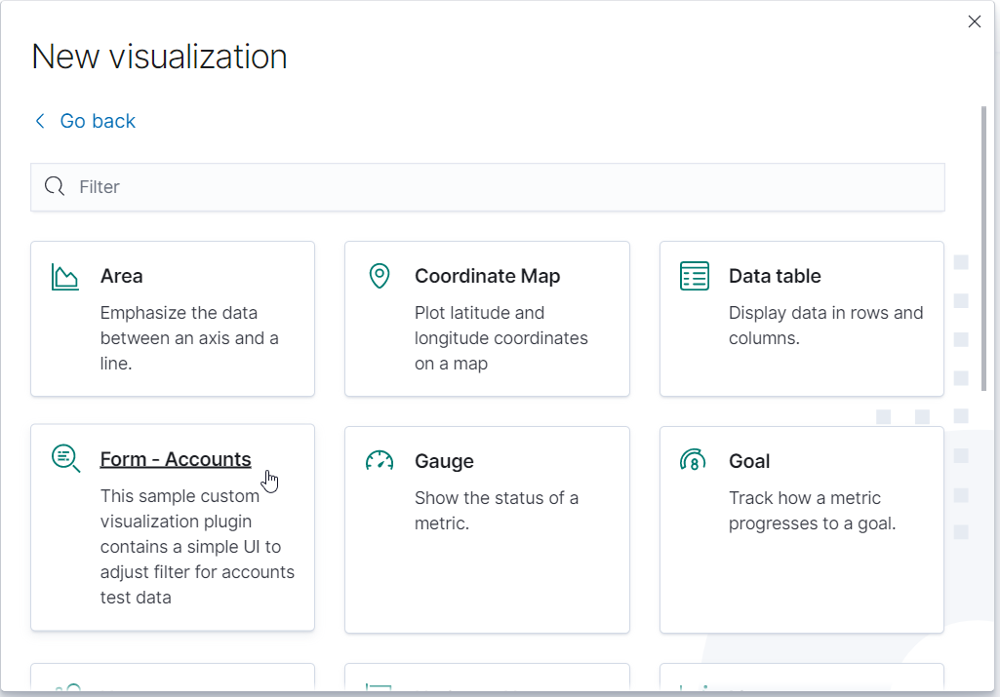
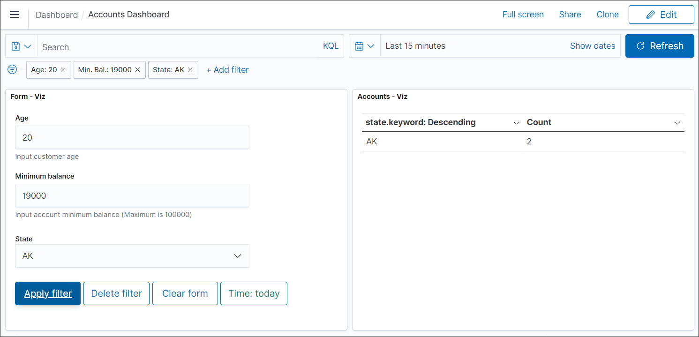

# Kibana Plugin - Custom Form Filter Visualization 

This project is a simple tutorial for Kibana new comers trying to developer their own vizualisation plugin. The actual usecase is to create a custom form to filter data to help end-users search their data.

This plugin is a demo for the accounts data which can be downloaded from elastic web site [here](https://download.elastic.co/demos/kibana/gettingstarted/accounts.zip) then uploaded via `curl -H 'Content-Type: application/x-ndjson' -XPOST 'localhost:9200/bank/account/_bulk?pretty' --data-binary @accounts.json`.

As plugin architecture is being under heavy redesign in 7.x and documentation is rather obscure, I did my best to create something simple that works.

This repository is for Kibana v7.7 while [this repository](https://github.com/guyplusplus/Kibana-Plugin-Custom-Form-Filter-Visualization-Legacy) is for 7.6 legacy architecture.

## Sample Screenshots

Few screen shots which makes it very easy to understand.






## Creating a dev. environment from scratch on Ubuntu

1. Install curl and JRE

```
$ sudo apt install curl
$ sudo apt install openjdk-11-jre-headless
```

2. Install latest Kibana and ElasticSearch via apt

```
$ wget -qO - https://artifacts.elastic.co/GPG-KEY-elasticsearch | sudo apt-key add -
$ sudo apt-get update
$ sudo apt-get install elasticsearch
$ sudo apt-get install kibana
```

For testing purpose, it may be required to install a specific (not latest) version of kibana or ElasticSearch.

```
$ sudo apt-get remove kibana    [for latest version]
$ sudo apt-get install kibana=7.6.2    [for a specific version]
```

3. Adjust listening IP address of kibana if network access is required

```
$ sudo vi /etc/kibana/kibana.yml
  server.host: "192.168.1.77" [update with correct value]
```

4. Start ElasticSearch then Kibana. Then open browser http://192.168.1.77:5601

```
$ sudo systemctl start elasticsearch
$ curl -X GET "localhost:9200"
$ sudo systemctl start kibana
$
```

5. Now to create a development environment, download nvm, git client and yarn

```
$ curl https://raw.githubusercontent.com/creationix/nvm/v0.25.0/install.sh | bash 
$ nvm install 10.18.0
$ sudo apt-get install git
$ curl -sS https://dl.yarnpkg.com/debian/pubkey.gpg | sudo apt-key add -
$ echo "deb https://dl.yarnpkg.com/debian/ stable main" | sudo tee /etc/apt/sources.list.d/yarn.list
$ sudo apt update
$ sudo apt install yarn
```

6. Download Kibana source code and select the target version

```
$ git clone https://github.com/elastic/kibana.git
$ cd kibana
$ git checkout v7.6.2 
```

7. Copy the source code with modified name inside `kibana/plugins`

8. Start in development mode, ensuring only OSS (Open Source) is used

```
$ nvm use
$ yarn kbn bootstrap
$ yarn start --oss
```

9. Kernel values for file monitoring may be required

```
$ echo fs.inotify.max_user_watches=524288 | sudo tee -a /etc/sysctl.conf
$ sudo sysctl -p
```

10. If you have problem to start Kibana dev 7.7.0 with ElasticSearch 7.7.0, add this line in `config/kibana.yml` config file. When upgrading from 7.6 to 7.0 I had to delete all indexes `curl -XDELETE localhost:9200/*`.

```
elasticsearch.ignoreVersionMismatch: true
```

## Building the plugin

Simply add the plugin directory inside a kibana folder and zip the file. The zip structure is

```
my-plugin_7.7.0.zip
  kibana/
    my-plugin/
      package.json
      config.js
      public/
        ...
      server/
        ...
```

## Installing the plugin

The plugin can then be installed like this.

```
$ sudo ./bin/kibana-plugin --allow-root install file:///home/john/downloads/kbn_tp_custom_form_filter_accounts_7.7.0_1.0.0.zip
$ sudo ./bin/kibana-plugin --allow-root install https://github.com/guyplusplus/Kibana-Plugin-Custom-Form-Filter-Visualization-Legacy/releases/download/1.0.0/kbn_tp_custom_form_filter_accounts_7.7.0_1.0.0.zip
```

Deleting then installing the plugin often fails for me. I fix it by running this command.

```
$ rm -rf /usr/share/kibana/optimize/bundles
```
