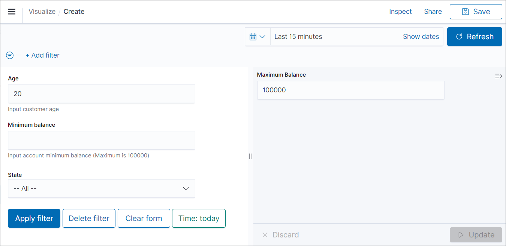

# Kibana Plugin - Custom Form Filter Visualization

This project is a simple tutorial for Kibana new comers trying to develop their own vizualisation plugin. The actual usecase of this plugin is to create a custom form to filter data and tailor dashboard output.

This plugin is a demo for the accounts data which can be downloaded from elastic web site [here](https://download.elastic.co/demos/kibana/gettingstarted/accounts.zip).

As plugin architecture is being under heavy redesign in 7.x and documentation is rather obscure, I did my best to create something simple that works. The code is also basic, I am JavaScript beginner!

This repository is for Kibana *coming soon* **v7.8 plugin New Platform (NP)** while [this repository](https://github.com/guyplusplus/Kibana-Plugin-Custom-Form-Filter-Visualization-Legacy) is for **v7.6.2 'legacy' architecture**.

This plugin is adapted from [vis_type_markdown](https://github.com/elastic/kibana/tree/7.8/src/plugins/vis_type_markdown) plugin.

## Sample Screenshots

Few screen shots which makes it very easy to understand.





## Creating a development environment from scratch on Ubuntu

1. Install curl and JRE

```shell
$ sudo apt install curl
$ sudo apt install openjdk-11-jre-headless
```

2. Install latest Kibana and ElasticSearch via apt

```shell
$ wget -qO - https://artifacts.elastic.co/GPG-KEY-elasticsearch | sudo apt-key add -
$ echo "deb https://artifacts.elastic.co/packages/7.x/apt stable main" | sudo tee /etc/apt/sources.list.d/elastic.list
$ sudo apt update
$ sudo apt install elasticsearch
$ sudo apt install kibana
```

For testing purpose, it may be required to install a specific (not latest) version of kibana or ElasticSearch.

```shell
$ sudo apt remove kibana    [for latest version]
$ sudo apt install kibana=7.8.0    [for a specific version]
```

3. Adjust listening IP address of kibana if network access is required

```shell
$ sudo vi /etc/kibana/kibana.yml
  server.host: "192.168.1.77"    [update with correct IP value]
```

4. Start ElasticSearch, possibly upload the accounts test data, then start Kibana. Then open browser http://192.168.1.77:5601    [update with correct IP value]

```shell
$ sudo systemctl start elasticsearch
$ curl -X GET "localhost:9200"
$ curl -H 'Content-Type: application/x-ndjson' -XPOST 'localhost:9200/bank/account/_bulk?pretty' --data-binary @accounts.json    [optional]
$ sudo systemctl start kibana
```

5. Now to create a development environment, download nvm, git client and yarn

```shell
$ curl https://raw.githubusercontent.com/creationix/nvm/v0.25.0/install.sh | bash    [then open a new terminal]
$ nvm install 10.21.0
$ sudo apt install git
$ curl -sS https://dl.yarnpkg.com/debian/pubkey.gpg | sudo apt-key add -
$ echo "deb https://dl.yarnpkg.com/debian/ stable main" | sudo tee /etc/apt/sources.list.d/yarn.list
$ sudo apt update
$ sudo apt install yarn
```

6. Download Kibana source code. . After download, `kibana` is the top directory. Then select the target version by selecting a tag or a branch (v7.6.2, v7.8.0, v7.8, etc.)

```shell
$ git clone https://github.com/elastic/kibana.git
$ cd kibana
$ git checkout v7.8.0
```

7. Copy the source code with modified name inside the `kibana/plugins` directory

8. Start Kibana in development mode, ensuring only OSS (Open Source Software) features are used

```shell
$ cd kibana
$ nvm use
$ yarn kbn bootstrap
$ yarn start --oss
```

9. Kernel values adjustment for large number of file monitoring may be required

```shell
$ echo fs.inotify.max_user_watches=524288 | sudo tee -a /etc/sysctl.conf
$ sudo sysctl -p
```

10. If you have a problem to start a higher version of Kibana than ElasticSearch, with the error message during development`[error][savedobjects-service] This version of Kibana (v8.0.0) is incompatible with the following Elasticsearch nodes in your cluster: v7.8.0 @ 127.0.0.1:9200 (127.0.0.1)`, add this line in `config/kibana.yml` config file. As a side note when upgrading from v7.6.2 to v7.8 branch I had to delete all indexes `curl -XDELETE localhost:9200/*`

```
elasticsearch.ignoreVersionMismatch: true
```

## Creating the actual form (step 7) for your own usecase

The current plugin name is based on the accounts test data. Simply perform a search replace in filenames and in the source code, respecting letter capitalization.

The form itself is contained in the [controller file](https://github.com/guyplusplus/Kibana-Plugin-Custom-Form-Filter-Visualization/blob/master/vis_type_custom_form_filter_accounts/public/custom_form_filter_accounts_vis_controller.tsx) file. An [option tab](https://github.com/guyplusplus/Kibana-Plugin-Custom-Form-Filter-Visualization/blob/master/vis_type_custom_form_filter_accounts/public/custom_form_filter_accounts_options.tsx) is also possible, actually one or more.

The form code looks like this and is very simple to modify, based on EUI React components.
* [EUI Documentation](https://elastic.github.io/eui/#/)
* [EUI GitHub repository](https://github.com/elastic/eui)

```xml
<div>
  <EuiForm>
    <EuiFormRow label="Age" helpText="Input customer age">
      <EuiFieldText name="age" onChange={e => this.onFormChange(e)} value={this.state.age} />
    </EuiFormRow>
    <EuiFormRow label="Minimum balance" helpText={minimumBalanceHelpText} >
      <EuiFieldText name="minimumBalance" onChange={e => this.onFormChange(e)} value={this.state.minimumBalance} />
    </EuiFormRow>
    <EuiSpacer />
    <EuiButton onClick={this.onClickButtonApplyFilter} fill>Apply filter</EuiButton>&nbsp;
    <EuiButton onClick={this.onClickButtonDeleteFilter} >Delete filter</EuiButton>&nbsp;
    <EuiButton onClick={this.onClickButtonClearForm} >Clear form</EuiButton>
  </EuiForm>
</div>
```

I use [Microsoft Code](https://code.visualstudio.com/) to edit code and [Google Chrome](https://www.google.com/chrome/) to debug.

## Packaging the plugin as a zip file

Simply add the plugin directory inside a `kibana` folder and zip the file. Filename format carries the Kibana version (i.e. 7.8.0) followed by the plugin version (i.e. 1.0.0). Do not include the `vis_type_custom_form_filter_accounts/target` directory in the zip file.

To change the Kibana version, just change the file `kbn_tp_custom_form_filter_accounts/package.json`, value `kibana.version`.

The zip structure is

```
vis_type_custom_form_filter_accounts_7.8.0_1.0.0.zip
  kibana/
    vis_type_custom_form_filter_accounts/
      package.json
      config.js
      public/
        ...
      server/
        ...
```

## Installing the plugin

The plugin can then be installed like this for an apt installed Kibana.

```shell
$ sudo ./bin/kibana-plugin --allow-root install file:///home/john/downloads/vis_type_custom_form_filter_accounts_7.8.0_1.0.0.zip
$ sudo ./bin/kibana-plugin --allow-root install https://github.com/guyplusplus/Kibana-Plugin-Custom-Form-Filter-Visualization/releases/download/1.0.0/vis_type_custom_form_filter_accounts_7.8.0_1.0.0.zip
```

Deleting then installing the plugin often fails for me. I fix it by running this command.

```shell
$ sudo ./bin/kibana-plugin --allow-root remove vis_type_custom_form_filter_accounts
Removing vis_type_custom_form_filter_accounts...
Plugin removal complete
$ sudo rm -rf /usr/share/kibana/optimize/bundles
$
```

## Project TODO List

- [ ] Create form content (i.e. dropdown, slider) with actual data
- [ ] Create a script to replace 'accounts' in filenames and file content
- [ ] Add internationalization example
- [ ] Create test script
- [ ] Create own plugin icon


